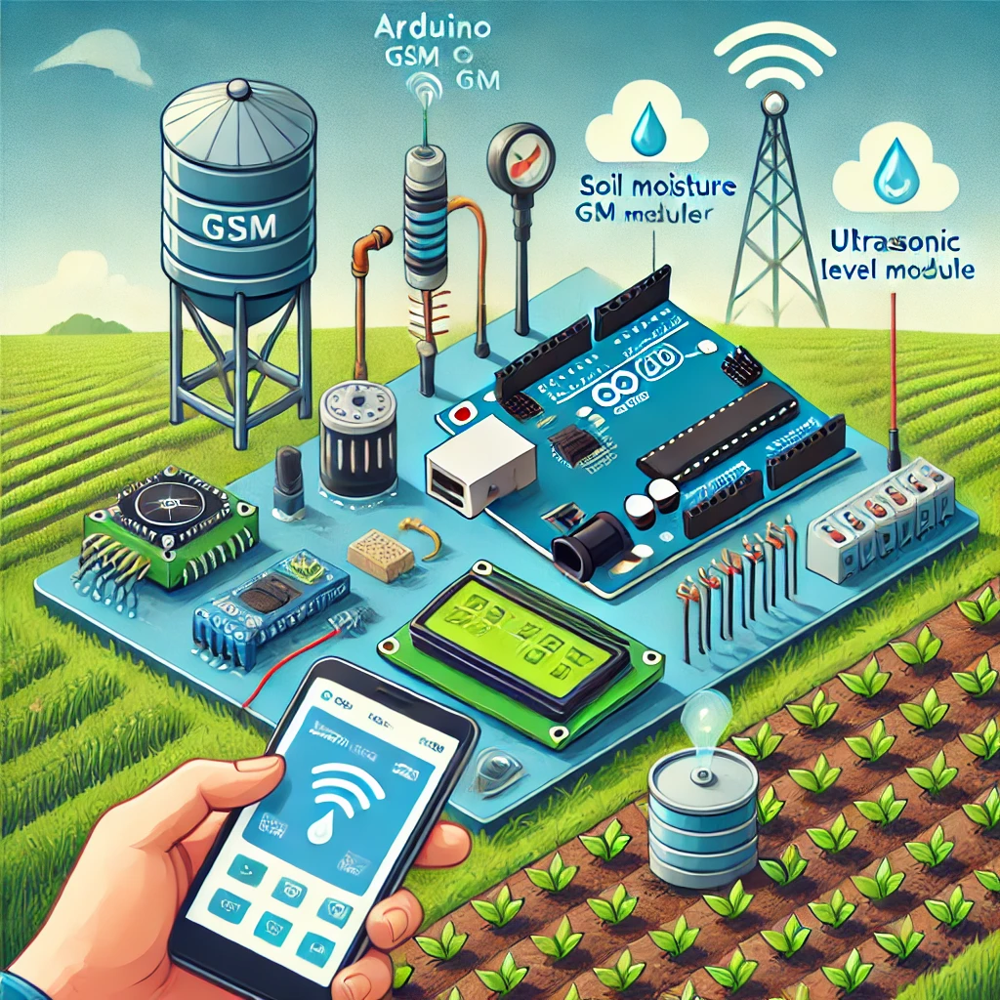

# GSM-Based Smart Irrigation System using Arduino Uno

## Overview
This project is an **open-source** GSM-based smart irrigation system using an **Arduino Uno**. It automates the watering process based on **moisture levels** and **tank water levels**, and allows users to control the system via **SMS commands** using a **SIM800L GSM module**.

## Features
- **Automatic Watering**: Uses a **moisture sensor** to detect soil moisture levels and turn the motor on/off accordingly.
- **Tank Level Monitoring**: An **ultrasonic sensor** measures the water level in the tank and sends alerts if it's low.
- **GSM Control via SMS**: Users can turn the water pump on/off or check status using SMS.
- **LCD 16x2 Display with I2C Module**: Provides real-time updates on system status.

## Components Used
1. **Arduino Uno**
2. **GSM Module SIM800L** (for SMS communication)
3. **LCD 16x2 with I2C Module** (for displaying status)
4. **Moisture Sensor** (to detect soil moisture levels)
5. **Ultrasonic Sensor** (to measure tank water level)
6. **230V Fish Tank Motor** (for water supply)
7. **12V Adapter** (to power the system)
8. **DC to DC Buck Converter** (for proper voltage supply to SIM800L)
9. **Relay Module** (to control the motor)

## Wiring & Connections
- **GSM Module (SIM800L)**
  - VCC → **5V (via Buck Converter)**
  - GND → **GND**
  - TX → **Pin 3 (Arduino)**
  - RX → **Pin 2 (Arduino)**

- **LCD 16x2 with I2C Module**
  - VCC → **5V**
  - GND → **GND**
  - SDA → **A4 (Arduino)**
  - SCL → **A5 (Arduino)**

- **Moisture Sensor**
  - VCC → **5V**
  - GND → **GND**
  - Signal → **A7 (Arduino)**

- **Ultrasonic Sensor**
  - VCC → **5V**
  - GND → **GND**
  - Trig → **A2 (Arduino)**
  - Echo → **A1 (Arduino)**

- **Relay Module**
  - IN1 → **Pin 6 (Arduino)**
  - IN2 → **Pin 7 (Arduino)**
  - VCC → **5V**
  - GND → **GND**

- **Motor (230V Fish Tank Pump)**
  - Connected via **Relay Module**

## How It Works
1. **System Startup**:
   - LCD displays "GSM Based Smart Irrigation System".
   - SIM800L initializes for SMS communication.
2. **Monitoring & Control**:
   - Soil moisture levels are continuously checked.
   - If moisture < 20%, the motor turns **ON** automatically.
   - If moisture > 70%, the motor turns **OFF**.
   - Tank level is checked via the ultrasonic sensor, and an alert is sent if it's below **50%**.
3. **SMS Commands**:
   - Send `"motor on"` to start the pump.
   - Send `"motor off"` to stop the pump.
   - Send `"status"` to get real-time updates.

## Code
The Arduino code for this project is available in the repository. Upload it using the **Arduino IDE**.

## Contribution
This project is **open source**! Feel free to use, modify, and improve it. If you find it useful, please **give credit** to this repository. Contributions are welcome!

